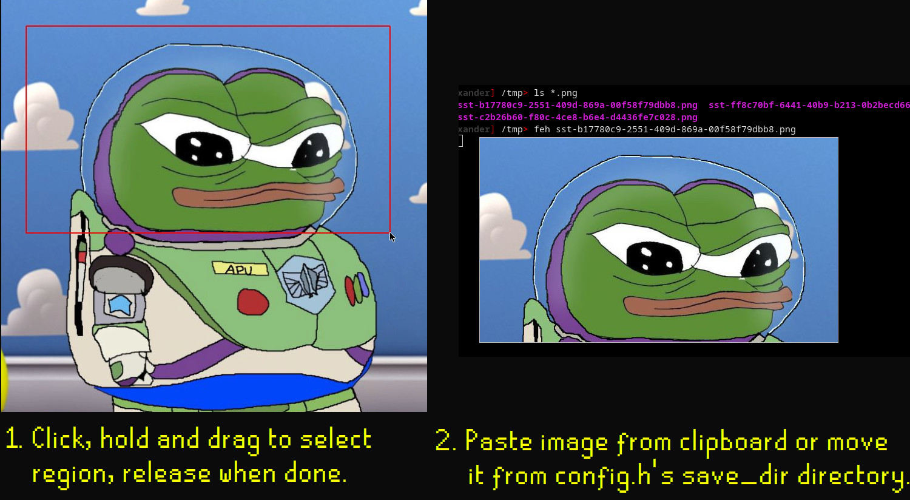

sst
---
sst ("Simple Screenshot Tool") is a screenshot/snipping program which uses Xorg and xclip.

After installing, bind it to a key. The selection is copied to the clipboard.

It has not been thoroughly tested across different distros and DEs, nor with multiple monitors.
This project will likely not be updated. Feel free to copy the codebase and expand on it.

Features:
- Copies the snippet
- [Suckless](https://suckless.org/philosophy/)-styled
- Small codebase (~350 SLOC), written in C99

Building
--------
Requires xclip, and dev libs for xlib and UUID.

`make`, followed by `make install` to install.

Portfolio and Demo
------------------

This was originally made as part of a code portfolio but it has turned into a tool which I have used daily for months at this point. The point of the project was to write a small tool, with clean code, that utilises a complex library.

Problems
--------
On some rare occasions my browser will change the permissions to /tmp/ and prevent screenshots from being saved. This is rare enough to where I do not care, but because of this you may want to change the screenshot save location within the config.h file.
